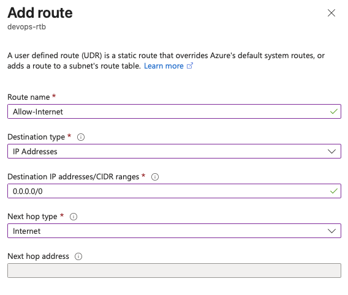
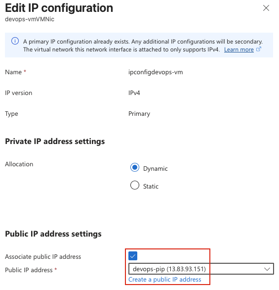
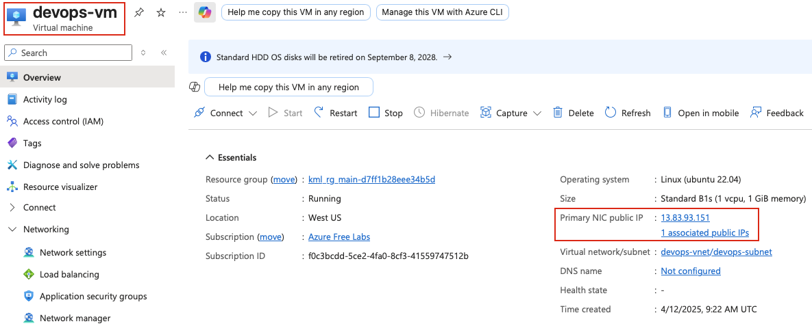
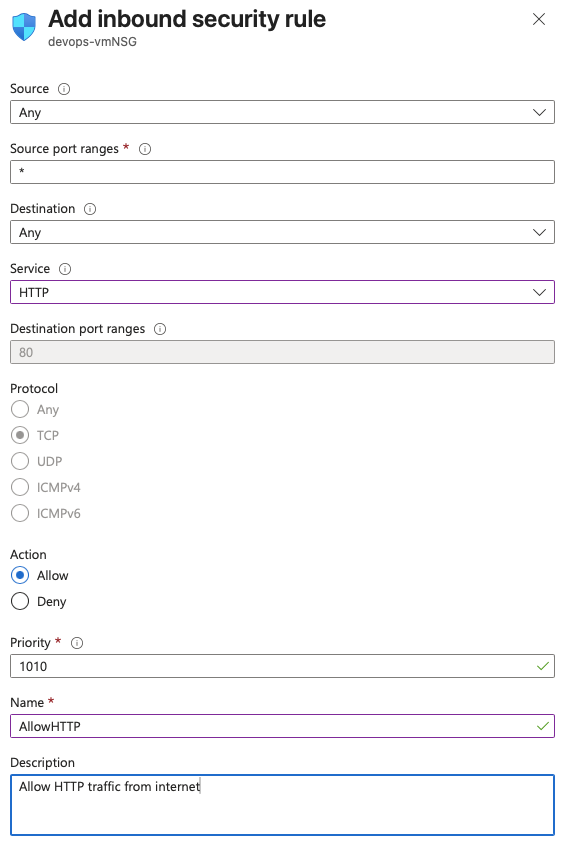

## Task: Troubleshooting Public Virtual Network Configurations
The Nautilus DevOps Team deployed an Nginx server on an Azure VM in a public VNet named `devops-vnet`. However, the server is still inaccessible from the internet.

As a DevOps team member, complete the following tasks:

1. **Verify VNet Configuration**: Ensure `devops-vnet` allows internet access.
2. **Attach Public IP**: A public IP named `devops-pip` already exists. Attach this public IP to the VM `devops-vm` to make it accessible from the internet.
3. **Ensure Accessibility**: Confirm the VM `devops-vm` is accessible on port `80`.
Use the provided Azure credentials to troubleshoot and resolve the issue.

--- 

## Solution

### **Step 1: Log in to Azure Portal**
Go to the Azure Portal:  
https://portal.azure.com  
Sign in with the credentials provided.

### **Step 2: Verify VNet Configuration**
- Go to Azure Portal → Virtual networks → devops-vnet.
- Select Subnets → choose the subnet where devops-vm resides.
- Ensure:
  - Route Table is Not Associated, OR
  - Associated route table does not contain:
    - 0.0.0.0/0 → Next hop: None
    - 0.0.0.0/0 → Next hop: Virtual appliance (unless intentional)  


### **Step 3: Attach Public IP to the VM**
Refer [Day10](Day10.md) to check how to attach public IP.  


### **Step 4: Verify Public IP Assignment**
Once the operation completes:

- Go back to **Virtual Machines** → **devops-vm**  
- On the **Overview** page, check the **Public IP address** field  
- Verify that it now shows the IP address from **devops-pip**  


### **Step 5: Update Inbound rules to Allow HTTP traffic**
- Go to **Settings** → **Inbound security rules** of the NSG attached to the VM
- Add inbound rule to allow HTTP traffic  


### **Step 6: Verify setup**
- SSH to the VM from the `azure-client` host's terminal:
```bash
ssh azureuser@<Public_IP>
```

- Install and start `nginx` service on `devops-vm`:
```bash
sudo apt update -y
sudo apt install nginx -y
sudo systemctl start nginx
sudo systemctl enable nginx
```

- Test the web server accessibility from your `azure-client` host's terminal:
```bash
curl http://<PUBLIC_IP>
```

You can complete the task with the following Azure CLI steps. These assume you are already logged into Azure (az login) and know the resource group containing the resources.

1. Verify the VNet allows internet access

A public VNet does not require any special configuration for outbound internet connectivity. Verify that the subnet and NSGs do not block inbound HTTP traffic.

List the VM and its networking information:

az vm show \
  --name nautilus-vm \
  --resource-group <RESOURCE_GROUP> \
  -d \
  --output table


Check the NSG associated with the VM or subnet:

az network nic list \
  --resource-group <RESOURCE_GROUP> \
  --output table


If there is no rule allowing TCP port 80, create one:

az network nsg rule create \
  --resource-group <RESOURCE_GROUP> \
  --nsg-name <NSG_NAME> \
  --name Allow-HTTP \
  --priority 1000 \
  --direction Inbound \
  --access Allow \
  --protocol Tcp \
  --destination-port-ranges 80

2. Attach the existing Public IP

Find the NIC attached to the VM:

NIC_NAME=$(az vm show \
  --resource-group <RESOURCE_GROUP> \
  --name nautilus-vm \
  --query "networkProfile.networkInterfaces[0].id" \
  -o tsv | awk -F/ '{print $NF}')


Attach the existing public IP nautilus-pip:

az network nic ip-config update \
  --resource-group <RESOURCE_GROUP> \
  --nic-name $NIC_NAME \
  --name ipconfig1 \
  --public-ip-address nautilus-pip


Verify:

az vm list-ip-addresses \
  --resource-group <RESOURCE_GROUP> \
  --name nautilus-vm \
  --output table

3. Install and configure Nginx

SSH to the VM using its public IP:

ssh azureuser@<PUBLIC_IP>


For Ubuntu/Debian:

sudo apt update
sudo apt install -y nginx
sudo systemctl enable nginx
sudo systemctl start nginx
sudo systemctl status nginx


For RHEL/CentOS/Rocky:

sudo dnf install -y nginx
sudo systemctl enable nginx
sudo systemctl start nginx
sudo systemctl status nginx

4. Verify Nginx is listening on port 80
sudo ss -tlnp | grep :80


Expected output should show Nginx listening on 0.0.0.0:80 or [::]:80.

5. Confirm internet accessibility

From your local machine:

curl http://<PUBLIC_IP>


or

http://<PUBLIC_IP>


You should receive the default Nginx welcome page.

Final checklist
✅ nautilus-vnet has no networking configuration preventing internet access.
✅ nautilus-pip is attached to nautilus-vm.
✅ NSG allows inbound TCP port 80.
✅ Nginx is installed.
✅ Nginx is enabled and running.
✅ VM is reachable from the internet on port 80.