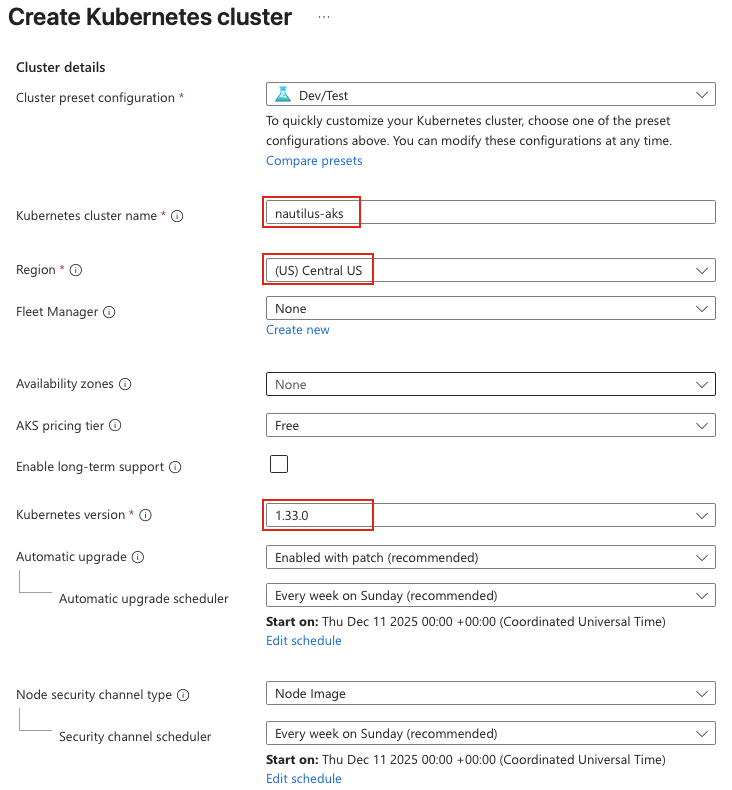
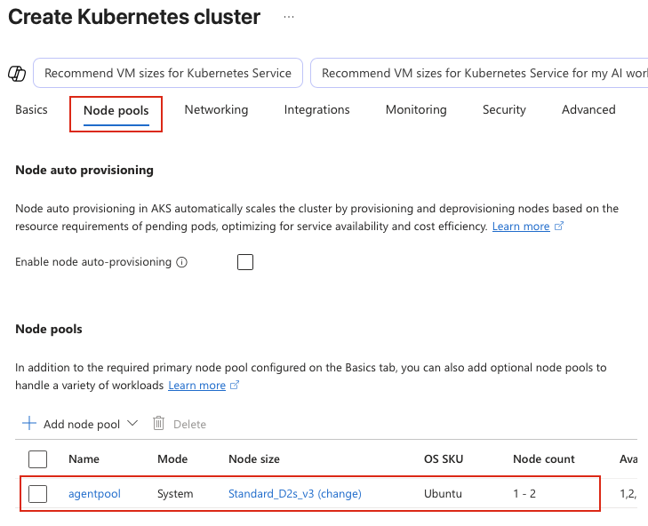
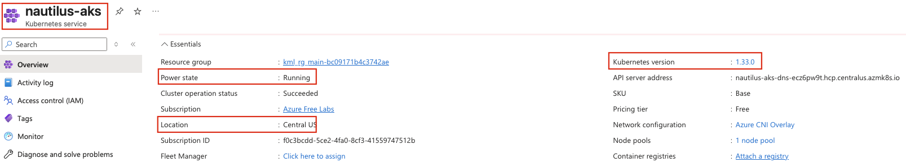

## Task: Azure Kubernetes Service (AKS) Setup and Management
The Nautilus DevOps team is tasked with preparing an AKS cluster to deploy a Kubernetes-based application. The team has the following requirements.

1. Create an AKS cluster named `nautilus-aks`
2. The Kubernetes version must be `1.33.0`
3. The AKS cluster endpoint access must be private
4. Ensure the cluster is created in the `Central US` region
5. Edit the `agentpool` Node pools (delete all other node pool if exists) and configure the cluster with the following properties:
   - Node size: `D2s v3`
   - Minimum node count: `1`
   - Maximum node count: `2`
6. Disable the `Container Insights` for now and disable all kind of monitoring as well

The AKS cluster must be configured with high availability and private endpoint access. Verify that the cluster meets the requirements and is ready for workloads.

---

## Solution

### **Step 1: Log in to Azure Portal**
Go to the Azure Portal:  
https://portal.azure.com  
Sign in with the credentials provided.

### **Step 2: Create AKS Cluster**
- In the Azure Portal, search for **Kubernetes services** in the top search bar
- Click **+ Create** > **Kubernetes cluster**

### **Step 3: Configure Basics Tab**
**Cluster Details:**
- **Kubernetes cluster name:** `nautilus-aks`
- **Region:** Central US
- **Kubernetes version:** `1.33.0`  

**Node pools:**
- **Node pool name:** `agentpool` (default)
- **Node size:** Click **Choose a size**
  - Search for `D2s v3`
  - Select **Standard_D2s_v3** (2 vCPUs, 8 GiB memory)
  - Click **Select**
- **Minimum node count:** `1`
- **Maximum node count:** `2`  

### **Step 4: Configure Networking Tab**
**CRITICAL - Private Cluster Configuration:**
- **Enable private cluster:** Checked (THIS IS REQUIRED)

Leave other options as default

### **Step 5: Review and Create**
Review all settings carefully:
- Cluster name: `nautilus-aks`
- Region: Central US
- Kubernetes version: `1.33.0`
- Private cluster: Enabled
- Node pool: `agentpool` with D2s_v3, min 1, max 2 nodes
- Monitoring: Disabled

Click **Create**

### **Step 6: Wait for Deployment**
AKS cluster deployment typically takes 5-10 minutes. Monitor the deployment progress:

### **Step 7: Navigate to AKS Cluster**
1. Click **Go to resource** to navigate to `nautilus-aks`
2. Review the **Overview** page  

# CLI
I can give you the exact Azure CLI procedure, but I don’t have an Azure subscription/portal connection available in this chat to actually create or modify the AKS cluster.

The current AKS documentation confirms that Kubernetes 1.36 is GA and supported through June 2027; you should select a currently offered 1.36.x patch in Central US rather than hard-code an outdated patch. 
M
Microsoft Learn

Recommended Azure CLI procedure

First, identify the resource group you want to use:

RG="devops-rg"
LOCATION="centralus"
CLUSTER="devops-aks"

Create it if necessary:

az group create \
  --name "$RG" \
  --location "$LOCATION"

Check which 1.36 patches are currently available in Central US:

az aks get-versions \
  --location centralus \
  --output table

Choose one of the currently available 1.36.x versions from that output. AKS recommends using the latest available patch for a minor version. 
M
Microsoft Learn

Then create the cluster as a private AKS cluster, with a single agentpool, D2s v3 nodes, autoscaling from 1–2 nodes, and no monitoring add-on:

K8S_VERSION="<available-1.36.x>"

az aks create \
  --resource-group "$RG" \
  --name "$CLUSTER" \
  --location "$LOCATION" \
  --kubernetes-version "$K8S_VERSION" \
  --nodepool-name agentpool \
  --node-vm-size Standard_D2s_v3 \
  --node-count 1 \
  --enable-cluster-autoscaler \
  --min-count 1 \
  --max-count 2 \
  --enable-private-cluster \
  --network-plugin azure \
  --generate-ssh-keys

az aks disable-addons \
  --addons monitoring \
  --resource-group "$RG" \
  --name "$CLUSTER"

Verification

Run:

az aks show \
  --resource-group "$RG" \
  --name "$CLUSTER" \
  --query '{
    name:name,
    location:location,
    kubernetesVersion:kubernetesVersion,
    provisioningState:provisioningState,
    privateCluster:apiServerAccessProfile.enablePrivateCluster,
    monitoring:addonProfiles.omsagent.enabled,
    prometheus:azureMonitorProfile.metrics.enabled
  }' \
  --output yaml

Finally:

az aks get-credentials \
  --resource-group "$RG" \
  --name "$CLUSTER" \
  --overwrite-existing

kubectl get nodes -o wide
kubectl get pods -A

You want to see:

location: centralus
Kubernetes: 1.36.x
privateCluster: true
provisioning state: Succeeded
only agentpool (unless AKS requires another system pool configuration)
VM size: Standard_D2s_v3
autoscaler: enabled
minimum: 1
maximum: 2
monitoring/Container Insights: disabled
nodes: Ready
system pods: healthy

One important caveat: a private AKS cluster's API server is reachable only through its private endpoint/network path, so kubectl verification must be performed from a machine with appropriate network connectivity to the private cluster.

